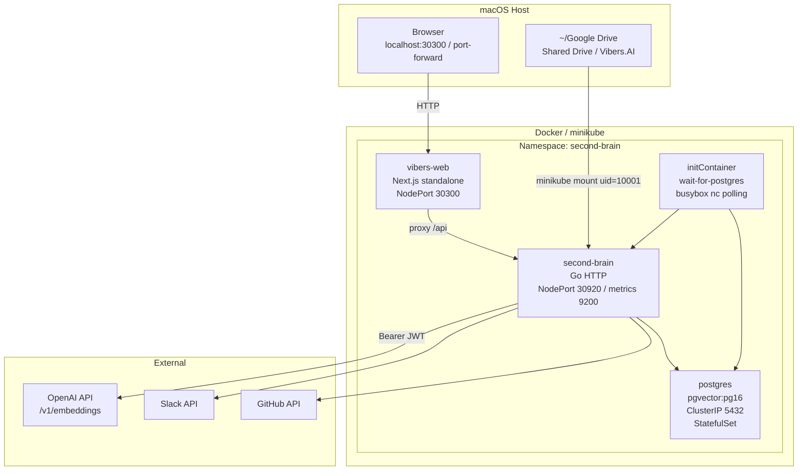
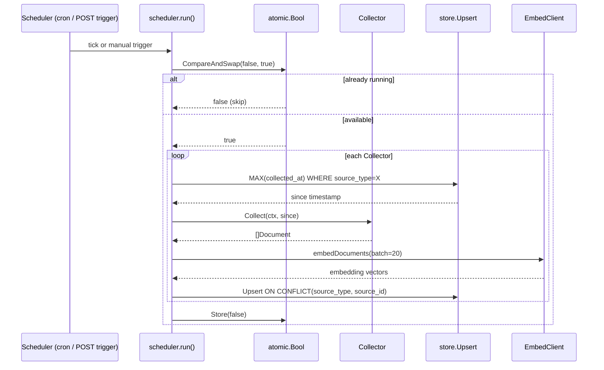
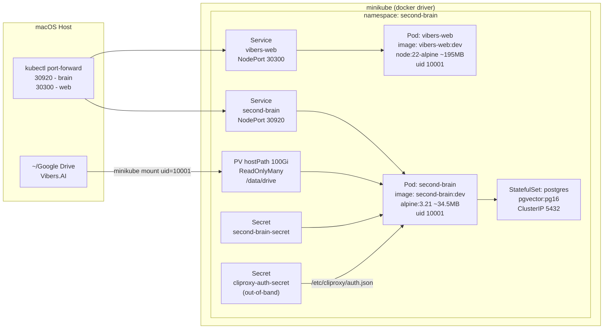

# second-brain Architecture

> Vision: Aggregate team knowledge from Google Drive, Slack, and GitHub into a unified vector + full-text search engine, enabling natural-language queries over internal information as an in-house RAG infrastructure.

---

## Table of Contents

1. [Overview](#1-overview)
2. [System Topology](#2-system-topology)
3. [Service Layer Map](#3-service-layer-map)
4. [Data Model](#4-data-model)
5. [Collection Pipeline](#5-collection-pipeline)
6. [Extraction Pipeline](#6-extraction-pipeline)
7. [Embedding Pipeline](#7-embedding-pipeline)
8. [Search Pipeline](#8-search-pipeline)
9. [Deployment Architecture](#9-deployment-architecture)
10. [Web UI Architecture](#10-web-ui-architecture)
11. [Configuration and Environment Variables](#11-configuration-and-environment-variables)
12. [Architecture Decision Records](#12-architecture-decision-records)
13. [Known Issues](#13-known-issues)
14. [Roadmap](#14-roadmap)

---

## 1. Overview

second-brain is a knowledge search platform composed of a Go backend service and a Next.js frontend UI. It collects documents from Google Drive, Slack messages, and GitHub issues and pull requests, vectorizes them using OpenAI embeddings, stores them in pgvector, and provides hybrid full-text and semantic search.

**Runtime Environment**: Deployed to a local Kubernetes cluster using Docker Desktop or minikube (docker driver) on macOS. Because the macOS docker driver does not expose NodePorts directly to the host, `kubectl port-forward` is the recommended access method.

**Current Scope**: Phase 0 complete. Document-level collection (no chunking), single Postgres instance, OpenAI text-embedding-3-small, minimal retry logic.

---

## 2. System Topology



### Mount Path

The command `minikube mount --uid=10001 --gid=10001 ~/Google\ Drive/Shared\ Drive/Vibers.AI:/mnt/drive` exposes the host Drive folder as a ReadOnlyMany hostPath PV (100 Gi) mounted at `/data/drive` inside the Pod.

---

## 3. Service Layer Map

### Backend (`second-brain` Go service)

| Directory | Role | Key Files |
|---|---|---|
| `cmd/server/` | Entry point | `main.go` — loads config, initializes store, embed client, registers collectors, starts scheduler, starts HTTP server |
| `internal/api/` | HTTP router and handlers | `router.go`, `search.go`, `document.go`, `source.go` |
| `internal/scheduler/` | Collection orchestration | `scheduler.go` — `atomic.Bool` CAS mutex, `embedDocuments`, `maxEmbedChars` |
| `internal/collector/` | Source adapters | `filesystem.go`, `slack.go`, `github.go`, `notion.go` (disabled), `gdrive_export.go` |
| `internal/collector/extractor/` | File content extraction | `extractor.go` + `SanitizeText`, `html.go`, `pdf.go`, `docx.go`, `xlsx.go`, `pptx.go` |
| `internal/search/` | Search and embedding client | `search.go`, `embed.go` — `EmbedClient`, `cliProxyToken`, `staticToken` |
| `internal/store/` | Postgres access layer | `document.go` — `fulltextSearch`, `vectorSearch`, `hybridSearch`, `sortOrder`, `ListBySource`, `Upsert` |
| `internal/model/` | Domain types | `document.go` — `Document`, `SearchQuery`, `SearchResult`, `SourceType` |
| `internal/config/` | Environment variables | `config.go` |
| `migrations/` | SQL migrations | `001_init.sql`, `002_soft_delete.sql` |

### Frontend (`vibers-web` Next.js service)

| Directory | Role |
|---|---|
| `web/src/app/` | App Router pages — `page.tsx` (search), `documents/[id]/page.tsx` (detail view), `api-docs/page.tsx` (API reference), `layout.tsx` (header nav) |
| `web/src/app/api/` | Next.js API routes acting as backend proxy — `search`, `documents`, `documents/[id]`, `documents/[id]/raw` |
| `web/src/lib/` | Utilities — `api.ts`, `types.ts`, `dates.ts` (24h format), `codeWrap.ts`, `summary.ts`, `preview.ts`, `docRender.ts` |
| `web/src/app/documents/[id]/MarkdownContent.tsx` | Client-side markdown renderer (react-markdown + remark-gfm + rehype-highlight) |
| `web/src/app/documents/[id]/XlsxTable.tsx` | TSV parser rendering a `<table>` per sheet |
| `web/src/app/globals.css` | Tailwind v4 + `@plugin "@tailwindcss/typography"` + highlight.js github-dark theme |

---

## 4. Data Model

### `documents` Table

| Column | Type | Constraint |
|---|---|---|
| `id` | uuid | PK, `gen_random_uuid()` |
| `source_type` | text | NOT NULL |
| `source_id` | text | NOT NULL |
| `title` | text | NOT NULL |
| `content` | text | NOT NULL |
| `metadata` | jsonb | default `'{}'` |
| `embedding` | vector(1536) | nullable |
| `tsv` | tsvector | generated stored — english + simple dictionaries, title weight A / content weight B |
| `collected_at` | timestamptz | NOT NULL — sourced from file ModTime |
| `created_at` | timestamptz | default `now()` |
| `updated_at` | timestamptz | default `now()` — refreshed on each Upsert |
| `status` | text | default `'active'` |
| `deleted_at` | timestamptz | nullable — soft delete marker |

### Indexes

| Index Type | Target Column(s) | Purpose |
|---|---|---|
| UNIQUE | `(source_type, source_id)` | Conflict key for Upsert |
| GIN | `(tsv)` | Full-text search |
| IVFFlat or HNSW | `(embedding vector_cosine_ops)` | Cosine similarity vector search |

---

## 5. Collection Pipeline



**Key behaviors**:
- Collection interval is configured via `COLLECT_INTERVAL` env var, or triggered manually via `POST /api/v1/collect/trigger`
- The `since` timestamp enables incremental collection — only changed documents are processed
- OpenAI `/v1/embeddings` is called in batches of 20
- `MAX_EMBED_CHARS` truncates input length to stay within the embedding API token limit
- Upsert uses `ON CONFLICT (source_type, source_id) DO UPDATE SET ...` for idempotent ingestion

---

## 6. Extraction Pipeline

The `internal/collector/extractor/` package selects the appropriate extractor by file extension and applies `SanitizeText` as a post-processing step.

### SanitizeText

A sanitization function applied universally to all extractor output:

1. Strip `\x00` (NULL bytes) — prevents Postgres `text` type storage errors
2. `strings.ToValidUTF8` — replaces invalid UTF-8 sequences
3. Collapse consecutive whitespace — reduces unnecessary whitespace

### Extractor Details

| Extension | Library | Approach |
|---|---|---|
| `.html`, `.htm` | `x/net/html` | Parse tag tree, extract text nodes |
| `.pdf` | `ledongthuc/pdf` | Text extraction with a 10-second timeout |
| `.docx` | standard library | OOXML unzip, parse `word/document.xml`, extract `<w:t>` text nodes |
| `.xlsx` | `excelize` | Open with `RawCellValue: true` to read raw cell values |
| `.pptx` | standard library | OOXML unzip, parse `ppt/slides/*.xml`, extract `<a:t>` text nodes |

### XLSX TSV Format

The xlsx extractor produces sheet-separated TSV output:

```
##SHEET Sheet1
col_a\tcol_b\tcol_c
val1\tval2\tval3
...

##SHEET Sheet2
...
```

- Empty rows and empty sheets are skipped
- Tab (`\t`), newline (`\n`), and carriage return (`\r`) characters inside cells are escaped
- A 200 KiB size cap is enforced
- The frontend `XlsxTable.tsx` parses `##SHEET` delimiters and renders up to 200 rows per sheet

---

## 7. Embedding Pipeline

### Token Source Priority

```go
func NewEmbedClient(apiURL, apiKey, authFilePath, model string) *EmbedClient {
    var ts tokenSource
    switch {
    case apiKey != "":        // Priority 1: OPENAI_API_KEY env var (static)
        ts = &staticToken{t: apiKey}
    case authFilePath != "": // Priority 2: JSON auth file (5-minute TTL, auto-refresh)
        ts = newCliProxyToken(authFilePath)
    }
    ...
}
```

### OpenAI ChatGPT Codex OAuth JWT as Direct Bearer (ADR-010)

The `cliproxy-auth-secret` Secret holds a ChatGPT Codex OAuth token (`auth.json`) that is volume-mounted at `/etc/cliproxy/auth.json` in the Pod. `cliProxyToken` reads the file on a 5-minute TTL and uses the access token directly in the Authorization Bearer header. It has been directly verified that the OpenAI `/v1/embeddings` endpoint accepts JWTs with `iss: auth.openai.com` and `aud: api.openai.com/v1`. No `cli-proxy-api` daemon is required.

### Batching and Truncation

- Batch size: 20 documents per API call
- On batch error: warn and continue (a failed batch does not abort the entire collection run)
- `MAX_EMBED_CHARS` truncates by character count as a temporary mitigation before chunking is implemented (ADR-009)

---

## 8. Search Pipeline

### Request Schema

```json
{
  "query": "BBQ meeting",
  "source_type": "filesystem",
  "limit": 10,
  "sort": "relevance",
  "include_deleted": false
}
```

### Response Schema

```json
{
  "results": [
    {
      "id": "...",
      "title": "...",
      "content": "...",
      "match_type": "hybrid",
      "score": 0.83,
      "collected_at": "...",
      "created_at": "...",
      "updated_at": "...",
      "metadata": {}
    }
  ],
  "count": 10,
  "total": 10,
  "query": "BBQ meeting",
  "took_ms": 42
}
```

### hybridSearch CTE (RRF)

```sql
WITH fts AS (
  SELECT id,
         row_number() OVER (
           ORDER BY GREATEST(
             ts_rank_cd(tsv, websearch_to_tsquery('english', $query)),
             ts_rank_cd(tsv, websearch_to_tsquery('simple', $query))
           ) DESC
         ) AS rank
  FROM documents
  WHERE tsv @@ websearch_to_tsquery('english', $query)
     OR tsv @@ websearch_to_tsquery('simple', $query)
    AND status = 'active'
  LIMIT $limit
),
vec AS (
  SELECT id,
         row_number() OVER (
           ORDER BY embedding <=> $query_embedding ASC
         ) AS rank
  FROM documents
  WHERE embedding IS NOT NULL
    AND status = 'active'
  LIMIT $limit
),
rrf AS (
  SELECT COALESCE(fts.id, vec.id) AS id,
         1.0 / (60 + COALESCE(fts.rank, 1000))
       + 1.0 / (60 + COALESCE(vec.rank, 1000)) AS score
  FROM fts
  FULL OUTER JOIN vec USING (id)
)
SELECT d.*, rrf.score
FROM rrf
JOIN documents d USING (id)
ORDER BY <sortOrder>
LIMIT $limit
```

**RRF constant k=60**: A community-validated default that provides stable rank fusion without disproportionately amplifying the contribution of top-ranked documents.

### sortOrder Whitelist

| sort parameter | SQL ORDER BY |
|---|---|
| `"recent"` | `d.collected_at DESC` |
| any other value (default: `"relevance"`) | `rrf.score DESC` |

---

## 9. Deployment Architecture



### Image Build Summary

| Image | Base | Size | UID |
|---|---|---|---|
| `second-brain:dev` | `alpine:3.21` | ~34.5 MB | 10001 |
| `vibers-web:dev` | `node:22-alpine` (standalone) | ~195 MB | 10001 |

### Accessing Services

The macOS docker driver does not expose NodePorts directly to the host. Use port-forwarding:

```bash
# Web UI
kubectl port-forward svc/vibers-web 30300:80 -n second-brain

# Backend API
kubectl port-forward svc/second-brain 30920:8080 -n second-brain
```

---

## 10. Web UI Architecture

### Page Structure

| Route | Component | Role |
|---|---|---|
| `/` | `page.tsx` | Search main — search bar, source filter, result card list |
| `/documents/[id]` | `page.tsx` | Document detail — format-dispatched rendering |
| `/api-docs` | `page.tsx` | API reference — 7 endpoint cards |

### Filter Options

```typescript
const FILTER_OPTIONS = [
  { label: "All", value: "" },
  { label: "Drive", value: "filesystem" },
  { label: "Slack", value: "slack" },
  { label: "GitHub", value: "github" },
];
```

Notion is currently disabled and excluded from the filter options.

### Reactivity Pattern

Search results are automatically re-fetched by two `useEffect` triggers:

- `[submittedQuery, activeFilter, sort]` changes — search mode
- `[activeFilter, isSearchMode]` changes — initial document listing

Request cancellation uses a `cancelled` flag pattern to prevent response race conditions.

Initial state (no query): `listRecentDocuments(10, source)` fetches the 10 most recent documents.

### Card Component

- Summary: `extractSummary(content, 180)` — up to 180 characters of leading content
- Timestamps: created / updated, two lines, 24h format (`dates.ts`)

### Document Detail Format Dispatch

The `getRenderKind(ext)` function determines the rendering strategy by file extension:

| Kind | Condition | Renderer |
|---|---|---|
| `image` | `.png`, `.jpg`, `.gif`, etc. | `` tag |
| `markdown` | `.md`, `.mdx` | `MarkdownContent` — react-markdown + remark-gfm + rehype-highlight, `<article className="prose prose-sm dark:prose-invert max-w-none">` |
| `xlsx` | `.xlsx` | `XlsxTable` — `##SHEET` TSV parser, up to 200 rows per sheet |
| `code` | `.ts`, `.go`, `.py`, etc. | Code block with highlight.js github-dark |
| `text` | all others | `<pre>` plain text |

**Document detail timestamp block** (`<dl>`, 3 entries):
- Collected at (file ModTime)
- Created at (DB created_at)
- Updated at (DB updated_at)

---

## 11. Configuration and Environment Variables

| Environment Variable | Default | Description |
|---|---|---|
| `DATABASE_URL` | (required) | Postgres connection string |
| `OPENAI_API_URL` | `https://api.openai.com` | OpenAI-compatible endpoint base URL |
| `OPENAI_API_KEY` | — | Static API key (token source priority 1) |
| `OPENAI_EMBED_MODEL` | `text-embedding-3-small` | Embedding model name |
| `CLIPROXY_AUTH_FILE` | — | Path to auth.json (token source priority 2) |
| `COLLECT_INTERVAL` | `1h` | Collection schedule interval (Go duration format) |
| `MAX_EMBED_CHARS` | — | Maximum character count for embedding input |
| `MIGRATIONS_DIR` | `migrations` | SQL migration file directory |
| `PORT` | `8080` | HTTP server port |
| `FILESYSTEM_ROOT` | `/data/drive` | Filesystem collector root path |
| `SLACK_TOKEN` | — | Slack Bot User OAuth token |
| `GITHUB_TOKEN` | — | GitHub Personal Access Token |

---

## 12. Architecture Decision Records

### ADR-001: pgvector Hybrid Search with RRF Fusion

**Context**: Semantic vector search alone lacks keyword precision, while full-text search alone misses semantically similar documents that do not share exact terms.

**Decision**: Combine FTS and vector search results using the Reciprocal Rank Fusion (RRF) algorithm. Use k=60 as the smoothing constant and a FULL OUTER JOIN so documents appearing in only one result set are still included.

**Consequences**: Search quality improves over either method alone. Each query requires an OpenAI embedding API call, which adds latency. A query embedding cache could mitigate this in future iterations.

---

### ADR-002: pgvector on Postgres 16 as a Single Database

**Context**: Separating the vector store and relational metadata store (e.g., Pinecone + RDS) would significantly increase operational complexity.

**Decision**: Use a single Postgres 16 instance with the pgvector extension installed. Deploy as a StatefulSet to ensure PVC-backed data persistence.

**Consequences**: Simplified operations and a single backup target. At very large scale (hundreds of millions of vectors), migration to a dedicated vector database may become necessary.

---

### ADR-003: Separate Go Backend and Next.js Frontend with App Router Proxy

**Context**: Bundling backend and frontend in a single server reduces development velocity and deployment independence.

**Decision**: Run the Go HTTP server (backend) and Next.js App Router (frontend) as independent services. The `web/src/app/api/` routes proxy all requests to the backend, avoiding CORS issues and keeping the backend address out of client-side code.

**Consequences**: Each service can be deployed and scaled independently. An additional Next.js API route layer is introduced, but client code is simplified.

---

### ADR-004: Docker + minikube Local Kubernetes Deployment

**Context**: Local development should use the same Kubernetes manifests as production, and multi-container orchestration is required.

**Decision**: Adopt minikube with the docker driver as the standard local environment. Define all services using Kubernetes manifests.

**Consequences**: Local and production environments share identical manifests. The macOS docker driver does not expose NodePorts to the host, so port-forward is required for local access.

---

### ADR-005: CliProxy OAuth Token Injected via k8s Secret Volume

**Context**: The ChatGPT Codex OAuth token is rotated periodically. Injecting it as an environment variable requires Pod restarts on each rotation.

**Decision**: Manage `cliproxy-auth-secret` out-of-band and volume-mount it at `/etc/cliproxy/auth.json` in the Pod. `cliProxyToken` reads the file on a 5-minute TTL to refresh the Bearer token.

**Consequences**: Token rotation does not require Pod restarts. The Secret must be managed outside of git, which requires a separate provisioning procedure.

---

### ADR-006: `-trimpath` Build Flag and `MIGRATIONS_DIR` Env Var

**Context**: Including absolute source paths in Go binaries reduces build reproducibility and can expose internal path information.

**Decision**: Use `go build -trimpath` to strip source file paths from the binary. Inject the migration file path via the `MIGRATIONS_DIR` environment variable to support both container and local path conventions.

**Consequences**: Improved build reproducibility and reduced path exposure. The environment variable must be set at deployment time.

---

### ADR-007: `atomic.Bool` CAS as Scheduler Mutex

**Context**: Duplicate collection runs can be triggered when a cron tick fires while a previous run is still in progress, or when a manual trigger races with the cron schedule.

**Decision**: Use `sync/atomic.Bool`'s `CompareAndSwap(false, true)` as a lightweight single-instance mutex. Prefer non-blocking skip over `sync.Mutex` blocking.

**Consequences**: Simple code with no deadlock risk. In a distributed deployment, an external lock (e.g., Redis) would be needed — this is adequate for the current single-Pod setup.

---

### ADR-008: Shared `SanitizeText` Function for Postgres NULL Byte Avoidance

**Context**: The Postgres `text` type cannot store NULL bytes (`\x00`), and various file formats may contain invalid UTF-8 sequences.

**Decision**: Apply `SanitizeText` uniformly to all extractor output. The processing order is: strip NULL bytes, replace invalid UTF-8, collapse whitespace.

**Consequences**: DB storage errors are eliminated. A small amount of information is lost (NULL bytes, malformed byte sequences), but this has no measurable impact on search quality.

---

### ADR-009: `MAX_EMBED_CHARS` Env Var as Pre-Chunking Mitigation

**Context**: The OpenAI embedding API has an input token limit (8,191 tokens). Large files such as PDFs and spreadsheets can exceed this limit.

**Decision**: Apply character-count truncation via the `MAX_EMBED_CHARS` environment variable. This is a temporary mitigation pending the chunking implementation planned for Phase 1.

**Consequences**: The tail content of long documents is excluded from their embeddings, which can reduce search recall for lengthy files. This variable will be removed after chunking is implemented.

---

### ADR-010: OpenAI ChatGPT Codex OAuth JWT as Direct Bearer Token

**Context**: Using a ChatGPT Plus Codex OAuth token to access the OpenAI API without a standard subscription was believed to require a middleware daemon (`cli-proxy-api`).

**Decision**: Use a JWT with `iss: auth.openai.com` and `aud: api.openai.com/v1` directly in the Authorization Bearer header when calling OpenAI `/v1/embeddings`. This has been directly verified to work without any daemon.

**Consequences**: Reduced infrastructure complexity (no daemon process required). This is an undocumented behavior; it may break if OpenAI changes its token validation policy. Migration to a standard API key is recommended before any production deployment.

---

## 13. Known Issues

| ID | Category | Description |
|---|---|---|
| BUG-007 | Data Completeness | `MAX_EMBED_CHARS` truncation causes the tail content of long documents to be missing from embeddings. To be resolved by chunking implementation in Phase 1. |
| — | Security | `cliproxy-auth-secret` is stored as a git placeholder. Actual tokens must be provisioned out-of-band and never committed to the repository. |
| — | Feature | PDF text extraction does not work for image-based PDFs (scanned documents). OCR integration is required. |
| — | Performance | Without chunking, full document content stored beyond 8 KB may be silently truncated in certain code paths. Chunking will resolve this. |

---

## 14. Roadmap

| Phase | Status | Key Deliverables |
|---|---|---|
| Phase 0 | Complete | Document-level collection, hybrid search, web UI, basic embedding pipeline |
| Phase 1 | Planned | Chunking (chunks table), PDF OCR, embedding retry logic, removal of `MAX_EMBED_CHARS` |
| Phase 2 | Planned | Semantic chunking strategies, LLM-based summary generation, document hierarchy support |
| Phase 3 | Planned | BGE-reranker integration, HyDE (Hypothetical Document Embeddings), query expansion |
| Phase 4 | Planned | Search feedback loop, click-through log collection, automated ranking improvement |

---

*Last updated: 2026-04-13*
