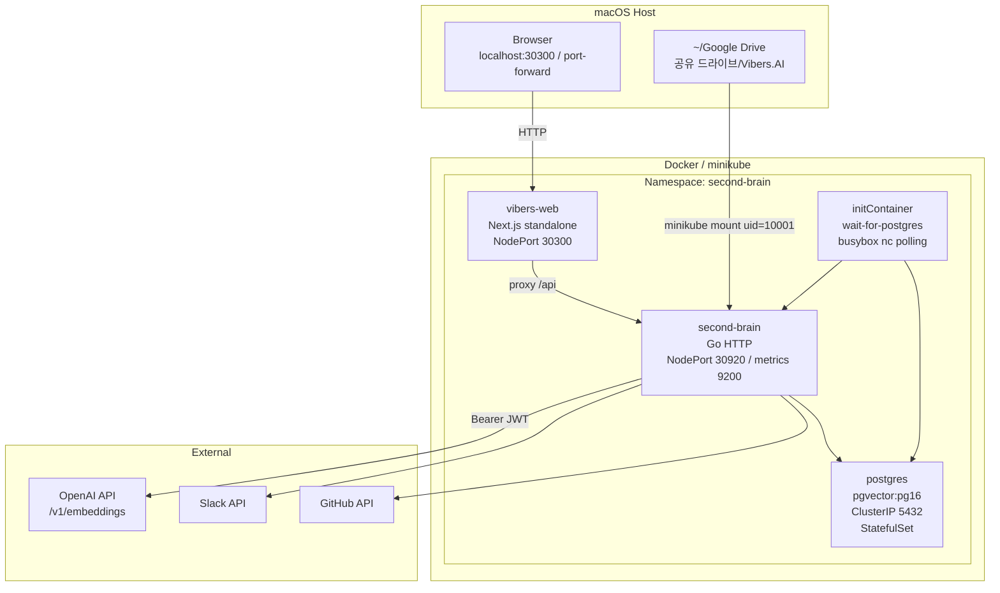
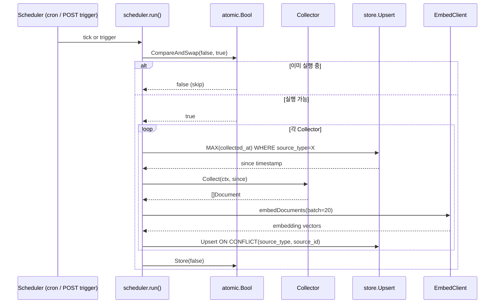
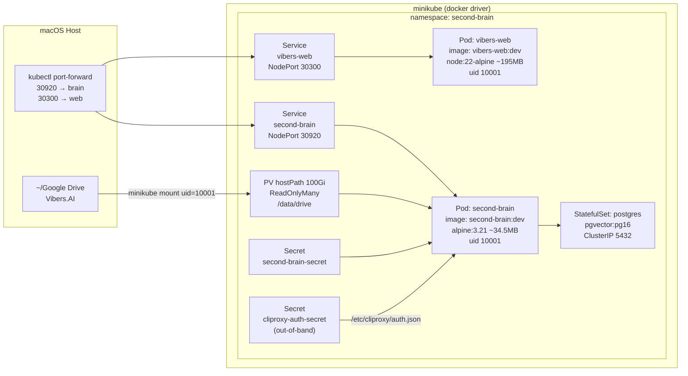

# second-brain 아키텍처

> 비전: Google Drive, Slack, GitHub 등 팀 지식을 단일 벡터+전문 검색 엔진으로 통합하여 자연어 질의로 즉시 검색할 수 있는 사내 RAG 인프라.

---

## 목차

1. [개요](#1-개요)
2. [시스템 구성도](#2-시스템-구성도)
3. [서비스 레이어 맵](#3-서비스-레이어-맵)
4. [데이터 모델](#4-데이터-모델)
5. [수집 파이프라인](#5-수집-파이프라인)
6. [추출 파이프라인](#6-추출-파이프라인)
7. [임베딩 파이프라인](#7-임베딩-파이프라인)
8. [검색 파이프라인](#8-검색-파이프라인)
9. [배포 아키텍처](#9-배포-아키텍처)
10. [웹 UI 아키텍처](#10-웹-ui-아키텍처)
11. [설정 및 환경 변수](#11-설정-및-환경-변수)
12. [설계 결정 ADR](#12-설계-결정-adr)
13. [알려진 이슈](#13-알려진-이슈)
14. [로드맵](#14-로드맵)

---

## 1. 개요

second-brain은 Go 기반 백엔드 서비스와 Next.js 기반 프론트엔드 UI로 구성된 지식 검색 플랫폼이다. Google Drive 파일, Slack 메시지, GitHub 이슈 및 PR을 수집하고 OpenAI 임베딩으로 벡터화한 뒤 pgvector에 저장하여 하이브리드 전문+의미 검색을 제공한다.

**실행 환경**: macOS에서 Docker Desktop 또는 minikube(docker driver)를 사용하여 로컬 Kubernetes 클러스터에 배포한다. macOS docker driver 특성상 NodePort가 호스트에 직접 노출되지 않으므로 `kubectl port-forward` 방식을 권장한다.

**현재 스코프**: Phase 0 완료 상태. 문서 단위 수집(청킹 없음), 단일 Postgres 인스턴스, OpenAI text-embedding-3-small, 최소 재시도 로직.

---

## 2. 시스템 구성도



### 마운트 경로

`minikube mount --uid=10001 --gid=10001 ~/Google\ Drive/공유\ 드라이브/Vibers.AI:/mnt/drive` 명령으로 호스트 Drive 폴더를 Pod 내 `/data/drive`에 ReadOnlyMany hostPath PV(100 Gi)로 노출한다.

---

## 3. 서비스 레이어 맵

### 백엔드 (`second-brain` Go 서비스)

| 디렉토리 | 역할 | 주요 파일 |
|---|---|---|
| `cmd/server/` | 엔트리포인트 | `main.go` — config 로드, store 초기화, embed 클라이언트, collector 등록, scheduler 시작, HTTP 서버 기동 |
| `internal/api/` | HTTP 라우터 및 핸들러 | `router.go`, `search.go`, `document.go`, `source.go` |
| `internal/scheduler/` | 수집 오케스트레이션 | `scheduler.go` — `atomic.Bool` CAS 뮤텍스, `embedDocuments`, `maxEmbedChars` |
| `internal/collector/` | 소스 어댑터 | `filesystem.go`, `slack.go`, `github.go`, `notion.go`(비활성화), `gdrive_export.go` |
| `internal/collector/extractor/` | 파일 내용 추출 | `extractor.go` + `SanitizeText`, `html.go`, `pdf.go`, `docx.go`, `xlsx.go`, `pptx.go` |
| `internal/search/` | 검색 및 임베딩 클라이언트 | `search.go`, `embed.go` — `EmbedClient`, `cliProxyToken`, `staticToken` |
| `internal/store/` | Postgres 접근 | `document.go` — `fulltextSearch`, `vectorSearch`, `hybridSearch`, `sortOrder`, `ListBySource`, `Upsert` |
| `internal/model/` | 도메인 타입 | `document.go` — `Document`, `SearchQuery`, `SearchResult`, `SourceType` |
| `internal/config/` | 환경 변수 | `config.go` |
| `migrations/` | SQL 마이그레이션 | `001_init.sql`, `002_soft_delete.sql` |

### 프론트엔드 (`vibers-web` Next.js 서비스)

| 디렉토리 | 역할 |
|---|---|
| `web/src/app/` | App Router 페이지 — `page.tsx` (검색), `documents/[id]/page.tsx` (상세), `api-docs/page.tsx` (API 레퍼런스), `layout.tsx` (헤더 네비) |
| `web/src/app/api/` | Next.js API 라우트 = 백엔드 proxy — `search`, `documents`, `documents/[id]`, `documents/[id]/raw` |
| `web/src/lib/` | 유틸리티 — `api.ts`, `types.ts`, `dates.ts` (24h 포맷), `codeWrap.ts`, `summary.ts`, `preview.ts`, `docRender.ts` |
| `web/src/app/documents/[id]/MarkdownContent.tsx` | 클라이언트 마크다운 렌더러 (react-markdown + remark-gfm + rehype-highlight) |
| `web/src/app/documents/[id]/XlsxTable.tsx` | TSV 파싱 후 시트별 `<table>` 렌더링 |
| `web/src/app/globals.css` | Tailwind v4 + `@plugin "@tailwindcss/typography"` + highlight.js github-dark 테마 |

---

## 4. 데이터 모델

### `documents` 테이블

| 컬럼 | 타입 | 제약 조건 |
|---|---|---|
| `id` | uuid | PK, `gen_random_uuid()` |
| `source_type` | text | NOT NULL |
| `source_id` | text | NOT NULL |
| `title` | text | NOT NULL |
| `content` | text | NOT NULL |
| `metadata` | jsonb | default `'{}'` |
| `embedding` | vector(1536) | nullable |
| `tsv` | tsvector | generated stored (english+simple 혼용, title 가중치 A / content 가중치 B) |
| `collected_at` | timestamptz | NOT NULL — 파일 ModTime 기준 |
| `created_at` | timestamptz | default `now()` |
| `updated_at` | timestamptz | default `now()` — Upsert 시 갱신 |
| `status` | text | default `'active'` |
| `deleted_at` | timestamptz | nullable — 소프트 삭제 |

### 인덱스

| 인덱스 종류 | 대상 컬럼 | 목적 |
|---|---|---|
| UNIQUE | `(source_type, source_id)` | Upsert 충돌 키 |
| GIN | `(tsv)` | 전문 검색 |
| IVFFlat 또는 HNSW | `(embedding vector_cosine_ops)` | 코사인 유사도 벡터 검색 |

---

## 5. 수집 파이프라인



**주요 동작**:
- `COLLECT_INTERVAL` 환경 변수로 주기 설정 (또는 `POST /api/v1/collect/trigger` 수동 트리거)
- `since` 타임스탬프로 증분 수집 — 전체 재수집 없이 변경분만 처리
- 배치 크기 20으로 OpenAI `/v1/embeddings` 호출
- `MAX_EMBED_CHARS`로 입력 길이 절단 (벡터 API 토큰 한도 회피)
- Upsert: `ON CONFLICT (source_type, source_id) DO UPDATE SET ...` — 멱등성 보장

---

## 6. 추출 파이프라인

`internal/collector/extractor/` 패키지가 파일 확장자에 따라 적절한 추출기를 선택하고 `SanitizeText`로 후처리한다.

### SanitizeText

모든 추출기 출력에 공통 적용되는 정제 함수:

1. `\x00` (NULL 바이트) 제거 — Postgres `text` 타입 저장 오류 방지
2. `strings.ToValidUTF8` — 유효하지 않은 UTF-8 시퀀스 치환
3. 연속 공백 압축 — 불필요한 공백 최소화

### 추출기별 상세

| 확장자 | 라이브러리 | 처리 방식 |
|---|---|---|
| `.html`, `.htm` | `x/net/html` | 태그 파싱 후 텍스트 노드 추출 |
| `.pdf` | `ledongthuc/pdf` | 10초 타임아웃 적용 텍스트 추출 |
| `.docx` | 표준 라이브러리 | OOXML unzip → `word/document.xml` → `<w:t>` 텍스트 노드 추출 |
| `.xlsx` | `excelize` | `RawCellValue:true` 옵션으로 원시 셀 값 읽기 |
| `.pptx` | 표준 라이브러리 | OOXML unzip → `ppt/slides/*.xml` → `<a:t>` 텍스트 노드 추출 |

### XLSX TSV 포맷

xlsx 추출기는 시트별로 구분된 TSV 형식으로 출력한다:

```
##SHEET Sheet1
col_a\tcol_b\tcol_c
val1\tval2\tval3
...

##SHEET Sheet2
...
```

- 빈 행 및 빈 시트 스킵
- 셀 내 `\t`, `\n`, `\r` 문자를 이스케이프 처리
- 200 KiB 용량 상한 적용
- 프론트엔드 `XlsxTable.tsx`가 `##SHEET` 구분자를 파싱하여 시트당 최대 200행 렌더링

---

## 7. 임베딩 파이프라인

### 토큰 소스 우선순위

```go
func NewEmbedClient(apiURL, apiKey, authFilePath, model string) *EmbedClient {
    var ts tokenSource
    switch {
    case apiKey != "":        // 1순위: OPENAI_API_KEY 환경 변수
        ts = &staticToken{t: apiKey}
    case authFilePath != "": // 2순위: JSON auth 파일 (5분 TTL 자동 갱신)
        ts = newCliProxyToken(authFilePath)
    }
    ...
}
```

### OpenAI ChatGPT Codex OAuth JWT 직접 Bearer (ADR-010)

`cliproxy-auth-secret`에 저장된 ChatGPT Codex OAuth 토큰(`auth.json`)을 Pod의 `/etc/cliproxy/auth.json`에 마운트하면 `cliProxyToken`이 5분 TTL로 읽어 Bearer 헤더에 사용한다. OpenAI `/v1/embeddings` 엔드포인트가 `iss: auth.openai.com`, `aud: api.openai.com/v1` JWT를 직접 수락하는 것이 검증되었다. `cli-proxy-api` 데몬이 불필요하다.

### 배칭 및 절단

- 배치 크기: 20 문서
- 에러 발생 시 warn + continue (배치 실패가 전체 수집을 중단하지 않음)
- `MAX_EMBED_CHARS` 환경 변수로 문자 수 절단 (청킹 구현 전 임시 완화책, ADR-009)

---

## 8. 검색 파이프라인

### 요청 스키마

```json
{
  "query": "BBQ 미팅",
  "source_type": "filesystem",
  "limit": 10,
  "sort": "relevance",
  "include_deleted": false
}
```

### 응답 스키마

```json
{
  "results": [
    {
      "id": "...",
      "title": "...",
      "content": "...",
      "match_type": "hybrid",
      "score": 0.83,
      "collected_at": "...",
      "created_at": "...",
      "updated_at": "...",
      "metadata": {}
    }
  ],
  "count": 10,
  "total": 10,
  "query": "BBQ 미팅",
  "took_ms": 42
}
```

### hybridSearch CTE (RRF)

```sql
WITH fts AS (
  SELECT id,
         row_number() OVER (
           ORDER BY GREATEST(
             ts_rank_cd(tsv, websearch_to_tsquery('english', $query)),
             ts_rank_cd(tsv, websearch_to_tsquery('simple', $query))
           ) DESC
         ) AS rank
  FROM documents
  WHERE tsv @@ websearch_to_tsquery('english', $query)
     OR tsv @@ websearch_to_tsquery('simple', $query)
    AND status = 'active'
  LIMIT $limit
),
vec AS (
  SELECT id,
         row_number() OVER (
           ORDER BY embedding <=> $query_embedding ASC
         ) AS rank
  FROM documents
  WHERE embedding IS NOT NULL
    AND status = 'active'
  LIMIT $limit
),
rrf AS (
  SELECT COALESCE(fts.id, vec.id) AS id,
         1.0 / (60 + COALESCE(fts.rank, 1000))
       + 1.0 / (60 + COALESCE(vec.rank, 1000)) AS score
  FROM fts
  FULL OUTER JOIN vec USING (id)
)
SELECT d.*, rrf.score
FROM rrf
JOIN documents d USING (id)
ORDER BY <sortOrder>
LIMIT $limit
```

**RRF 상수 k=60**: 검색 커뮤니티에서 검증된 기본값으로, 고순위 문서의 기여를 과도하게 증폭시키지 않으면서도 순위 결합 효과를 안정적으로 제공한다.

### sortOrder 화이트리스트

| sort 파라미터 | SQL 정렬 |
|---|---|
| `"recent"` | `d.collected_at DESC` |
| 그 외 (기본값 `"relevance"`) | `rrf.score DESC` |

---

## 9. 배포 아키텍처



### 이미지 빌드

| 이미지 | 베이스 | 크기 | UID |
|---|---|---|---|
| `second-brain:dev` | `alpine:3.21` | ~34.5 MB | 10001 |
| `vibers-web:dev` | `node:22-alpine` (standalone) | ~195 MB | 10001 |

### 접근 방법

macOS docker driver 환경에서는 NodePort가 호스트에 직접 노출되지 않는다. 아래 명령으로 포트 포워딩을 사용한다:

```bash
# 웹 UI
kubectl port-forward svc/vibers-web 30300:80 -n second-brain

# 백엔드 API
kubectl port-forward svc/second-brain 30920:8080 -n second-brain
```

---

## 10. 웹 UI 아키텍처

### 페이지 구조

| 경로 | 컴포넌트 | 역할 |
|---|---|---|
| `/` | `page.tsx` | 검색 메인 — 검색바, 필터, 결과 카드 목록 |
| `/documents/[id]` | `page.tsx` | 문서 상세 — 포맷별 렌더링 분기 |
| `/api-docs` | `page.tsx` | API 레퍼런스 — 7개 엔드포인트 카드 |

### 필터 옵션

```typescript
const FILTER_OPTIONS = [
  { label: "전체", value: "" },
  { label: "Drive", value: "filesystem" },
  { label: "Slack", value: "slack" },
  { label: "GitHub", value: "github" },
];
```

(Notion은 현재 비활성화 상태로 UI에서 제거됨)

### 반응성 패턴

검색 결과는 두 가지 `useEffect` 트리거로 자동 재요청된다:

- `[submittedQuery, activeFilter, sort]` 변경 시 — 검색 모드
- `[activeFilter, isSearchMode]` 변경 시 — 초기 문서 목록

요청 취소는 `cancelled` 플래그 패턴으로 구현하여 응답 경쟁 상태를 방지한다.

초기 상태(검색어 없음): `listRecentDocuments(10, source)`로 최근 10개 문서 표시.

### 카드 컴포넌트

- 요약: `extractSummary(content, 180)` — 최대 180자 짧은 설명
- 타임스탬프: 생성일 / 수정일 2줄, 24h 포맷 (`dates.ts`)

### 문서 상세 포맷 분기

`getRenderKind(ext)` 함수가 확장자에 따라 렌더링 방식을 결정한다:

| 종류 | 조건 | 렌더러 |
|---|---|---|
| `image` | `.png`, `.jpg`, `.gif` 등 | `` 태그 |
| `markdown` | `.md`, `.mdx` | `MarkdownContent` — react-markdown + remark-gfm + rehype-highlight |
| `xlsx` | `.xlsx` | `XlsxTable` — `##SHEET` TSV 파싱, 시트당 최대 200행 |
| `code` | `.ts`, `.go`, `.py` 등 | 코드 블록 (highlight.js github-dark) |
| `text` | 그 외 | `<pre>` plain text |

**문서 상세 타임스탬프** (`<dl>` 3줄):
- 수집 시각 (파일 ModTime)
- 생성 시각 (DB created_at)
- 수정 시각 (DB updated_at)

---

## 11. 설정 및 환경 변수

| 환경 변수 | 기본값 | 설명 |
|---|---|---|
| `DATABASE_URL` | (필수) | Postgres 연결 문자열 |
| `OPENAI_API_URL` | `https://api.openai.com` | OpenAI 호환 엔드포인트 |
| `OPENAI_API_KEY` | — | Static API 키 (1순위 토큰 소스) |
| `OPENAI_EMBED_MODEL` | `text-embedding-3-small` | 임베딩 모델 이름 |
| `CLIPROXY_AUTH_FILE` | — | auth.json 경로 (2순위 토큰 소스) |
| `COLLECT_INTERVAL` | `1h` | 수집 주기 (Go duration 형식) |
| `MAX_EMBED_CHARS` | — | 임베딩 입력 최대 문자 수 |
| `MIGRATIONS_DIR` | `migrations` | SQL 마이그레이션 디렉토리 |
| `PORT` | `8080` | HTTP 서버 포트 |
| `FILESYSTEM_ROOT` | `/data/drive` | 파일시스템 수집 루트 |
| `SLACK_TOKEN` | — | Slack Bot User OAuth 토큰 |
| `GITHUB_TOKEN` | — | GitHub Personal Access Token |

---

## 12. 설계 결정 ADR

### ADR-001: pgvector 하이브리드 검색 (RRF 결합)

**Context**: 자연어 쿼리에서 의미 검색(벡터)만으로는 키워드 정확도가 떨어지고, 전문 검색(FTS)만으로는 의미적 유사 문서를 놓친다.

**Decision**: Reciprocal Rank Fusion(RRF) 알고리즘으로 FTS와 벡터 검색 결과를 결합한다. k=60 상수, FULL OUTER JOIN으로 한쪽에만 존재하는 결과도 포함한다.

**Consequences**: 검색 품질이 단일 방식 대비 향상되었다. 단, 쿼리당 OpenAI 임베딩 API 호출이 필요하여 지연이 증가한다. 쿼리 임베딩 캐시로 완화 가능하다.

---

### ADR-002: pgvector on Postgres 16 단일 DB

**Context**: 벡터 스토어와 관계형 메타데이터 스토어를 분리할 경우(Pinecone + RDS 등) 운영 복잡도가 크게 증가한다.

**Decision**: pgvector 확장이 설치된 Postgres 16 단일 인스턴스를 사용한다. StatefulSet으로 배포하여 PVC 기반 데이터 영속성을 확보한다.

**Consequences**: 운영 단순화, 단일 백업 대상. 대규모 확장 시(수억 벡터) 전용 벡터 DB로 마이그레이션이 필요할 수 있다.

---

### ADR-003: Go 서버 + Next.js UI 분리, App Router proxy

**Context**: 백엔드와 프론트엔드를 단일 서버에 통합하면 개발 속도와 배포 독립성이 떨어진다.

**Decision**: Go HTTP 서버(백엔드)와 Next.js App Router(프론트엔드)를 독립 서비스로 분리한다. 프론트엔드의 `web/src/app/api/` 라우트가 백엔드로 요청을 프록시하여 CORS 문제를 피하고 클라이언트에 백엔드 주소를 노출하지 않는다.

**Consequences**: 각 서비스를 독립적으로 배포 및 스케일 가능. Next.js API 라우트라는 추가 레이어가 생기지만 클라이언트 코드가 단순해진다.

---

### ADR-004: Docker + minikube 로컬 Kubernetes 배포

**Context**: 프로덕션 환경과 동일한 Kubernetes 매니페스트로 로컬 개발이 가능해야 하며, 멀티 컨테이너 오케스트레이션이 필요하다.

**Decision**: docker driver 기반 minikube를 표준 로컬 환경으로 채택한다. 모든 서비스를 Kubernetes 매니페스트로 정의한다.

**Consequences**: 프로덕션 매니페스트와 로컬 환경을 동일하게 유지할 수 있다. macOS docker driver 특성상 NodePort 직접 접근이 제한되므로 port-forward를 사용해야 한다.

---

### ADR-005: CliProxy OAuth 토큰을 k8s Secret 볼륨 주입

**Context**: ChatGPT Codex OAuth 토큰은 정기적으로 갱신되며, 환경 변수로 주입하면 재배포 없이 갱신이 어렵다.

**Decision**: `cliproxy-auth-secret` Secret을 out-of-band로 관리하고 Pod의 `/etc/cliproxy/auth.json`에 볼륨 마운트한다. `cliProxyToken`이 5분 TTL로 파일을 읽어 Bearer 토큰을 갱신한다.

**Consequences**: 토큰 갱신 시 Pod 재시작 불필요. Secret은 git에 포함되지 않아야 하므로 별도 관리 절차가 필요하다.

---

### ADR-006: `-trimpath` 빌드 + `MIGRATIONS_DIR` env

**Context**: Go 바이너리에 절대 경로가 포함되면 빌드 재현성이 낮아지고 경로 노출 보안 이슈가 발생한다.

**Decision**: `go build -trimpath` 플래그로 빌드하여 소스 경로를 제거한다. 마이그레이션 파일 경로는 `MIGRATIONS_DIR` 환경 변수로 주입하여 컨테이너 내 경로와 로컬 경로 모두 지원한다.

**Consequences**: 빌드 재현성 향상, 경로 노출 방지. 배포 시 환경 변수 설정이 필요하다.

---

### ADR-007: `atomic.Bool` CAS scheduler 뮤텍스

**Context**: 수집 작업이 실행 중일 때 cron 틱 또는 수동 트리거가 중복 실행을 시도할 수 있다.

**Decision**: `sync/atomic.Bool`의 `CompareAndSwap(false, true)`로 단순한 단일 인스턴스 뮤텍스를 구현한다. `sync.Mutex`를 쓰지 않고 논블로킹 skip을 선택한다.

**Consequences**: 코드가 단순하고 교착 상태 위험이 없다. 분산 환경에서는 Redis 등 외부 잠금이 필요하다(현재 단일 Pod 운영이므로 충분함).

---

### ADR-008: `SanitizeText` 공유 함수 (Postgres 0x00 회피)

**Context**: Postgres `text` 타입은 NULL 바이트(`\x00`)를 저장할 수 없으며, 다양한 파일 형식에서 유효하지 않은 UTF-8이 포함될 수 있다.

**Decision**: 모든 추출기 출력에 `SanitizeText`를 공통으로 적용한다. NULL 바이트 제거 → 유효 UTF-8 치환 → 공백 압축 순서로 처리한다.

**Consequences**: DB 저장 오류가 사라졌다. 약간의 정보 손실(NULL 바이트, 잘못된 바이트)이 있지만 검색 품질에는 영향이 없다.

---

### ADR-009: `MAX_EMBED_CHARS` env (청킹 전 임시 완화책)

**Context**: OpenAI 임베딩 API는 토큰 입력 한도(8191 토큰)가 있으며, 대형 파일(PDF, XLSX)의 전체 내용이 초과할 수 있다.

**Decision**: `MAX_EMBED_CHARS` 환경 변수로 문자 수 기준 절단을 적용한다. 이는 Phase 1의 청킹 구현 전 임시 완화책이다.

**Consequences**: 긴 문서의 뒷부분이 임베딩에서 누락된다. 검색 재현율이 저하될 수 있다. 청킹 구현 후 이 환경 변수는 제거될 예정이다.

---

### ADR-010: OpenAI ChatGPT Codex OAuth JWT 직접 Bearer

**Context**: OpenAI API 키를 구독 없이 사용하려면 ChatGPT Plus의 Codex OAuth 토큰을 활용하는 방법이 있으나, 미들웨어(`cli-proxy-api` 데몬)가 필요한 것으로 알려져 있었다.

**Decision**: `iss: auth.openai.com`, `aud: api.openai.com/v1` JWT를 OpenAI `/v1/embeddings` 엔드포인트의 Bearer 헤더에 직접 사용한다. 데몬 없이 동작하는 것이 직접 검증되었다.

**Consequences**: 인프라 복잡도 감소 (데몬 프로세스 불필요). 비공식 동작이므로 OpenAI 정책 변경 시 중단될 수 있다. 프로덕션 전환 시 정식 API 키로 교체를 권장한다.

---

## 13. 알려진 이슈

| ID | 유형 | 설명 |
|---|---|---|
| BUG-007 | 데이터 누락 | `MAX_EMBED_CHARS` 절단으로 긴 문서의 후반부가 임베딩에서 누락됨. 청킹 구현으로 해결 예정 |
| — | 보안 | `cliproxy-auth-secret`은 git placeholder 상태. 실제 토큰은 out-of-band 배포 필요 |
| — | 기능 | PDF 텍스트 추출이 이미지 기반 PDF(스캔본)에서는 동작하지 않음. OCR 통합 필요 |
| — | 성능 | 단일 문서 임베딩 없이 전체 내용 저장 시 8 KB 절단 이슈 발생 가능. 청킹으로 해결 예정 |

---

## 14. 로드맵

| 단계 | 상태 | 주요 내용 |
|---|---|---|
| Phase 0 | 완료 | 문서 단위 수집, 하이브리드 검색, 웹 UI, 기본 임베딩 파이프라인 |
| Phase 1 | 계획 | 청킹(chunks 테이블), PDF OCR, 임베딩 재시도 로직, `MAX_EMBED_CHARS` 제거 |
| Phase 2 | 계획 | 의미 기반 청킹, LLM 요약 생성, 문서 계층 구조 지원 |
| Phase 3 | 계획 | BGE-reranker 통합, HyDE(Hypothetical Document Embeddings), 쿼리 확장 |
| Phase 4 | 계획 | 검색 피드백 루프, 클릭 로그 수집, 자동 랭킹 개선 |

---

*Last updated: 2026-04-13*
